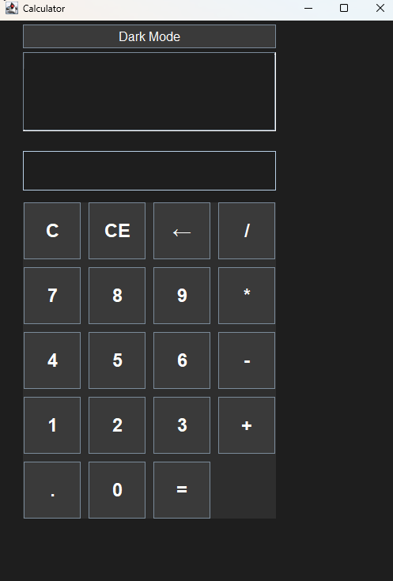

# 🧮 Java Calculator GUI

A simple yet powerful desktop calculator application built with **Java Swing**.

This project showcases my ability to create interactive GUI applications, implement user-friendly features, and follow professional development workflows using Git and GitHub.

---

## 🚀 Features

- ✅ Basic arithmetic operations: `+`, `-`, `×`, `÷`
- ✅ Live input display and operation label
- ✅ Error handling (e.g., divide by zero)
- ✅ Keyboard support (numbers, enter, backspace, delete)
- ✅ CE (Clear Entry), C (Clear All), and Backspace functions
- ✅ Dark Mode toggle 🌙
- ✅ Scrollable history log of previous calculations
- ✅ Responsive layout using `GridLayout`

---

## 🎯 Why I Built This

Built a custom GUI calculator from scratch  
To strengthen my Java GUI development skills and demonstrate interactive app design  
Resulted in a clean, accessible, and feature-rich calculator with full keyboard support and theme switching

---

## 📷 Screenshots


---

## 🛠️ Technologies Used

- Java 17
- Swing (JFrame, JPanel, JTextField, JButton, JLabel, etc.)
- IntelliJ IDEA
- Git & GitHub

---

## 🧪 How to Run

> Make sure you have JDK 17 or higher installed.

```bash
# Navigate to the project directory
cd CalculatorGUI

# Compile
javac -d out src/calculator/Calculator.java

# Run
java -cp out calculator.Calculator
